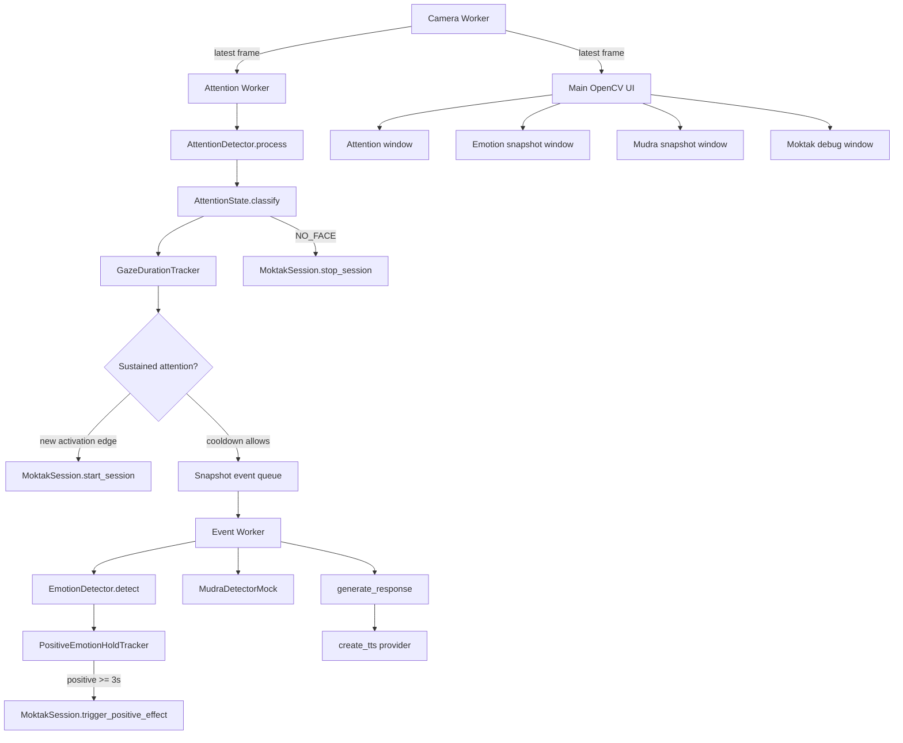

# Main App Workflow

```mermaid
flowchart TD
    A[Camera Worker] -->|latest frame| B[Attention Worker]
    A -->|latest frame| C[Main OpenCV UI]

    B --> D[AttentionDetector.process]
    D --> E[AttentionState.classify]
    E --> F[GazeDurationTracker]
    F --> G{Sustained attention?}

    G -->|new activation edge| H[MoktakSession.start_session]
    E -->|NO_FACE| I[MoktakSession.stop_session]

    G -->|cooldown allows| J[Snapshot event queue]
    J --> K[Event Worker]
    K --> L[EmotionDetector.detect]
    K --> M[MudraDetectorMock]
    L --> N[PositiveEmotionHoldTracker]
    N -->|positive >= 3s| O[MoktakSession.trigger_positive_effect]

    K --> P[generate_response]
    P --> Q[create_tts provider]

    C --> R[Attention window]
    C --> S[Emotion snapshot window]
    C --> T[Mudra snapshot window]
    C --> U[Moktak debug window]
```

