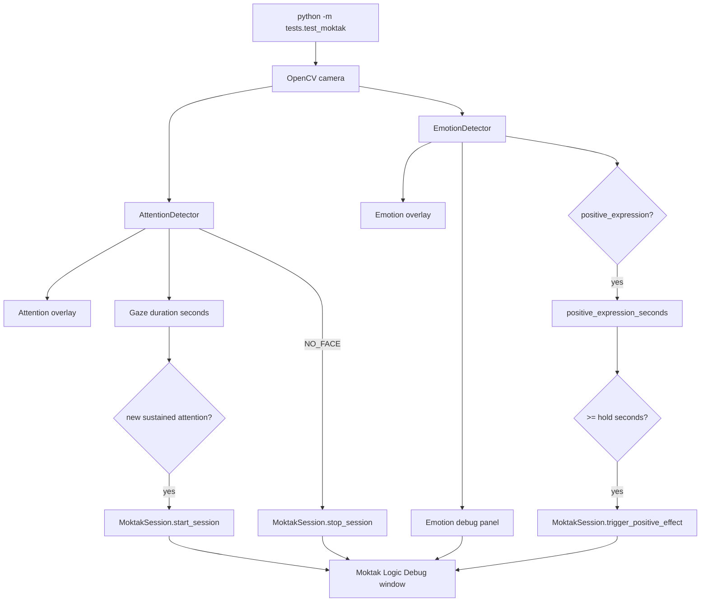

# Manual Moktak Debug Workflow

```mermaid
flowchart TD
    A["python -m tests.test_moktak"] --> B[OpenCV camera]
    B --> C[AttentionDetector]
    B --> D[EmotionDetector]

    C --> E[Attention overlay]
    C --> F[Gaze duration seconds]
    D --> G[Emotion overlay]
    D --> H[Emotion debug panel]

    F --> I{new sustained attention?}
    I -->|yes| J[MoktakSession.start_session]

    D --> K{positive_expression?}
    K -->|yes| L[positive_expression_seconds]
    L --> M{>= hold seconds?}
    M -->|yes| N[MoktakSession.trigger_positive_effect]

    C -->|NO_FACE| O[MoktakSession.stop_session]

    J --> P[Moktak Logic Debug window]
    N --> P
    O --> P
    H --> P
```

