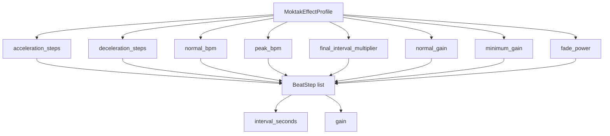

# Moktak Positive Effect Profile

```mermaid
flowchart LR
    A[positive_expression detected] --> B[PositiveEmotionHoldTracker]
    B -->|less than hold seconds| C[keep PLAYING]
    B -->|>= MOKTAK_POSITIVE_HOLD_SECONDS| D[trigger positive effect once]

    D --> E[Acceleration phase]
    E --> F["B_up(t) = sin^2(pi t / 2Ta)"]
    F --> G["normal_bpm -> peak_bpm"]
    G --> H["interval = 60 / bpm"]

    H --> I[Deceleration + fade phase]
    I --> J["B_down(t) = 0.5 * (1 + cos(pi t / Td))"]
    J --> K["peak_bpm -> final_bpm"]
    K --> L["gain fades to minimum_gain"]
    L --> M[STOPPED]
```

```mermaid
flowchart TD
    A[MoktakEffectProfile] --> B[acceleration_steps]
    A --> C[deceleration_steps]
    A --> D[normal_bpm]
    A --> E[peak_bpm]
    A --> F[final_interval_multiplier]
    A --> G[normal_gain]
    A --> H[minimum_gain]
    A --> I[fade_power]

    B --> J[BeatStep list]
    C --> J
    D --> J
    E --> J
    F --> J
    G --> J
    H --> J
    I --> J

    J --> K[interval_seconds]
    J --> L[gain]
```

