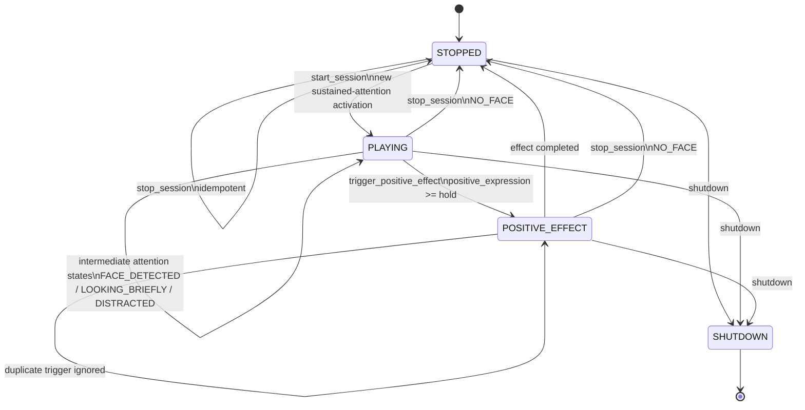
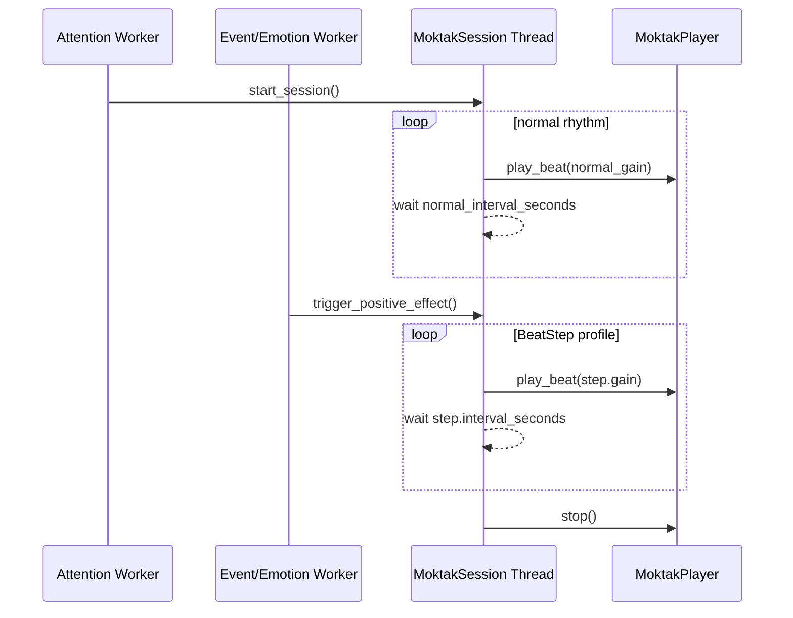

# Moktak Session Lifecycle

```mermaid
stateDiagram-v2
    [*] --> STOPPED

    STOPPED --> PLAYING: start_session\nnew sustained-attention activation
    STOPPED --> STOPPED: stop_session\nidempotent

    PLAYING --> PLAYING: intermediate attention states\nFACE_DETECTED / LOOKING_BRIEFLY / DISTRACTED
    PLAYING --> STOPPED: stop_session\nNO_FACE
    PLAYING --> POSITIVE_EFFECT: trigger_positive_effect\npositive_expression >= hold

    POSITIVE_EFFECT --> STOPPED: effect completed
    POSITIVE_EFFECT --> STOPPED: stop_session\nNO_FACE
    POSITIVE_EFFECT --> POSITIVE_EFFECT: duplicate trigger ignored

    STOPPED --> SHUTDOWN: shutdown
    PLAYING --> SHUTDOWN: shutdown
    POSITIVE_EFFECT --> SHUTDOWN: shutdown
    SHUTDOWN --> [*]
```

```mermaid
sequenceDiagram
    participant Attention as Attention Worker
    participant Emotion as Event/Emotion Worker
    participant Session as MoktakSession Thread
    participant Player as MoktakPlayer

    Attention->>Session: start_session()
    loop normal rhythm
        Session->>Player: play_beat(normal_gain)
        Session-->>Session: wait normal_interval_seconds
    end

    Emotion->>Session: trigger_positive_effect()
    loop BeatStep profile
        Session->>Player: play_beat(step.gain)
        Session-->>Session: wait step.interval_seconds
    end
    Session->>Player: stop()
```

